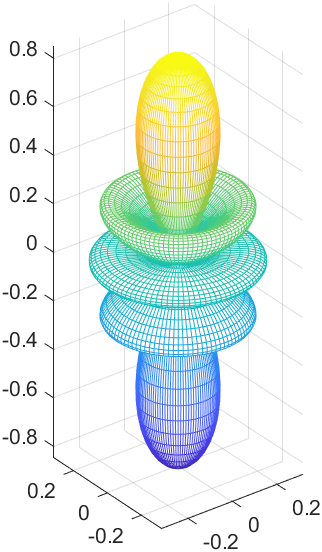
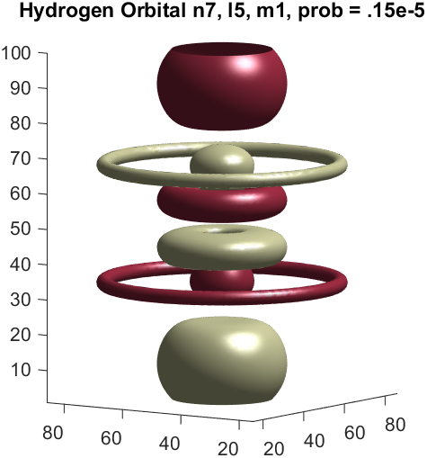

# MatlabProjects
Repo that contains the work done by me on matlab through different projects

### Spherical Harmonic with m=3 and l=4

  

### Spherical Harmonic with m=0 and l=4

  

### Hydrogen Orbital with n=5, l=3, m=0

  

### Hydrogen Orbital with n=7, l=5, m=1

  

